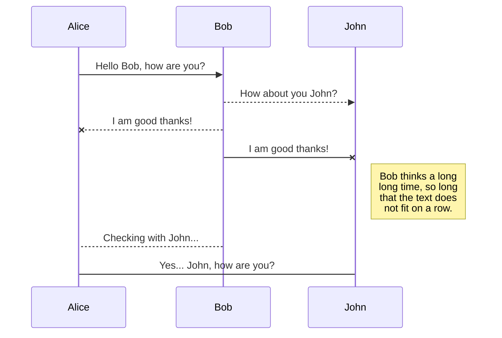

# Lex and Yacc
For basic information regarding regarding how Lex and Yacc works go [here](https://cse.iitkgp.ac.in/~bivasm/notes/LexAndYaccTutorial.pdf) .


### Yyparse function
---

The `yyparse` function is a crucial function generated by the Yacc (Yet Another Compiler Compiler) tool when you use it to create a parser for a programming language or any other formal grammar. Yacc generates a parser in C code, and the `yyparse` function is a part of that generated code.

Here's a brief explanation of its role:

1.  **Parsing Input:**
    
    -   `yyparse` is the function responsible for parsing the input according to the grammar rules specified in your Yacc specifications.
2.  **Rule Execution:**
    
    -   It executes actions associated with grammar rules when it recognizes them in the input.
3.  **Error Handling:**
    
    -   It handles syntax errors and error recovery. If there's a syntax error in the input, `yyparse` attempts to recover from the error and continue parsing.
4.  **Interface with Lex:**
    
    -   `yyparse` typically interacts with the lexical analyzer (often generated by Lex) to get tokens for processing.
5.  **Generated Code:**
    
    -   The code for `yyparse` is generated automatically by Yacc based on the grammar rules you provide.

---

    int main() {
        yyparse();  // Calls the generated parser
        return 0;
    }
---
### <u>Yylex function<u/>
The `yylex` function is a crucial part of the code generated by the Lex (Lexical Analyzer Generator) tool. This function is automatically generated in the `lex.yy.c` file when you use Lex to create a lexical analyzer for a programming language or any other application that requires tokenization.

Here's a brief explanation of the role of `yylex`:

1.  **Tokenization:**
    
    -   `yylex` is responsible for identifying and returning the next token in the input stream. Tokens are the smallest units of meaning in the context of the language or application you are working with.
2.  **Pattern Matching:**
    
    -   It performs pattern matching on the input stream using the regular expressions you define in your Lex specifications. When a match is found, the corresponding action associated with that pattern is executed.
3.  **Interface with Yacc:**
    
    -   `yylex` typically interacts with the parser (often generated by Yacc) by providing tokens for further processing. The parser calls `yylex` to get the next token.
4.  **Error Handling:**
    
    -   It can also handle errors, such as reporting syntax errors or unrecognized input, depending on how you design your Lex specifications.
5.  **Generated Code:**
    
    -   The code for `yylex` is generated automatically by Lex based on the rules and patterns you define in your Lex specifications.
---
```c
int yylex();  // Declaration of yylex function

int main() {
    while (1) {
        int token = yylex();  // Calls the generated lexer to get the next token
        // Process the token or break the loop if there are no more tokens
    }
    return 0;
}

```
---

### <u>Yytext, yyleng and yyout<u/>
In the context of Lex and Yacc-generated code, `yytext`, `yyleng`, and `yyout` are variables commonly used in the generated C code for lexical analysis and parsing. Let me explain each of them:

1.  **`yytext`:**
    
    -   `yytext` is a character pointer that points to the current token in the input stream. When `yylex` is called and a pattern is matched, `yytext` is set to the matched portion of the input.
    -   For example, if you have a rule in your Lex specifications like `int {return INT;}`, and the input stream contains the token "int", then `yytext` would point to the string "int."
2.  **`yyleng`:**
    
    -   `yyleng` is an integer variable that contains the length of the current token pointed to by `yytext`. It represents the number of characters in the matched token.
    -   In the example mentioned earlier, if `yytext` points to "int," then `yyleng` would be set to the length of the string "int," which is 3.
3.  **`yyout`:**
    
    -   `yyout` is a file pointer that represents the output file where the generated code writes its output. It is used to redirect the output of the lexer or parser to a file or another stream.
    -   By default, `yyout` is set to `stdout` (the standard output), but you can redirect it to a file or another stream as needed. For example, you might use `yyout` to redirect the output of the parser to a file rather than the console.

Here's a simplified example that illustrates the use of these variables:

```c
#include <stdio.h>

extern char* yytext;
extern int yyleng;
extern FILE* yyout;

int yylex() {
    // Lexical analysis logic here...
    // Set yytext and yyleng appropriately based on the matched token.

    // Example of redirecting output to a file
    fprintf(yyout, "Token: %s, Length: %d\n", yytext, yyleng);

    // Return the token type
    return TOKEN_TYPE;
}

int main() {
    yyout = fopen("output.txt", "w");  // Redirect output to a file

    while (1) {
        int token = yylex();  // Calls the generated lexer to get the next token
        if (token == END_OF_FILE) {
            break;  // Exit the loop if there are no more tokens
        }
        // Process the token or perform other actions
    }

    fclose(yyout);  // Close the output file

    return 0;
}

```
---

### <u>What is yywrap()?<u/>

In the context of Lex (Lexical Analyzer Generator), the `yywrap` function is used to provide additional control and handling when the end of the input stream (EOF) is encountered during lexical analysis. The name "yywrap" stands for "wrap-up."

The primary purpose of `yywrap` is to allow for the implementation of custom actions when the lexer reaches the end of the input. It returns an integer value, and its typical usage is as follows:

-   If `yywrap` returns 0, the lexer continues processing, considering it as a signal that there is more input available.
-   If `yywrap` returns a non-zero value, the lexer assumes that there is no more input, and it stops processing.

Here's a simplified example of how `yywrap` might be used:

```c
int yywrap() {
    // Custom logic to handle the end of input
    // Return 0 to indicate that more input is available, or a non-zero value to signal the end
    return 1; // Signal the end of input
}

```
---
### <u>What is yylineno()?<u/>
In Lex (Lexical Analyzer Generator), the `yylineno` variable is commonly used to keep track of the current line number in the input source code being processed by the lexical analyzer. It is not automatically provided by Lex but is often manually maintained in the user's code.

Here's a typical way `yylineno` is used:

1.  **Initialization:**
    
    -   At the beginning of the Lex file or in the user's initialization code, `yylineno` is usually initialized to 1 (or the starting line number).

```c
int yylineno = 1;

```
2. **Updating `yylineno`:**

-   In the rules section of the Lex file, you can update `yylineno` based on the occurrence of newline characters in the input. Typically, this is done using the special pattern `[\n]` to match newline characters.
```c
[\n]    { yylineno++; }

```
- This rule increments `yylineno` each time a newline character is encountered in the input.

3. **Accessing `yylineno`:**

-   Once `yylineno` is updated appropriately, you can use its value in your Lex rules or actions. For example, you might include it in error messages to indicate the line number where an issue occurred.
```c
identifier    {
                printf("Identifier '%s' found at line %d\n", yytext, yylineno);
               }

```
- So, in summary, `yylineno` is a variable that the lexer developer maintains to keep track of the line number in the input file. It is particularly useful for providing information about the location of tokens in error messages or for debugging purposes. Keep in mind that the exact implementation might vary based on the specific requirements of your lexer.

<!-- ## Rename a file

You can rename the current file by clicking the file name in the navigation bar or by clicking the **Rename** button in the file explorer.

## Delete a file

You can delete the current file by clicking the **Remove** button in the file explorer. The file will be moved into the **Trash** folder and automatically deleted after 7 days of inactivity.

## Export a file

You can export the current file by clicking **Export to disk** in the menu. You can choose to export the file as plain Markdown, as HTML using a Handlebars template or as a PDF.


# Synchronization

Synchronization is one of the biggest features of StackEdit. It enables you to synchronize any file in your workspace with other files stored in your **Google Drive**, your **Dropbox** and your **GitHub** accounts. This allows you to keep writing on other devices, collaborate with people you share the file with, integrate easily into your workflow... The synchronization mechanism takes place every minute in the background, downloading, merging, and uploading file modifications.

There are two types of synchronization and they can complement each other:

- The workspace synchronization will sync all your files, folders and settings automatically. This will allow you to fetch your workspace on any other device.
	> To start syncing your workspace, just sign in with Google in the menu.

- The file synchronization will keep one file of the workspace synced with one or multiple files in **Google Drive**, **Dropbox** or **GitHub**.
	> Before starting to sync files, you must link an account in the **Synchronize** sub-menu.

## Open a file

You can open a file from **Google Drive**, **Dropbox** or **GitHub** by opening the **Synchronize** sub-menu and clicking **Open from**. Once opened in the workspace, any modification in the file will be automatically synced.

## Save a file

You can save any file of the workspace to **Google Drive**, **Dropbox** or **GitHub** by opening the **Synchronize** sub-menu and clicking **Save on**. Even if a file in the workspace is already synced, you can save it to another location. StackEdit can sync one file with multiple locations and accounts.

## Synchronize a file

Once your file is linked to a synchronized location, StackEdit will periodically synchronize it by downloading/uploading any modification. A merge will be performed if necessary and conflicts will be resolved.

If you just have modified your file and you want to force syncing, click the **Synchronize now** button in the navigation bar.

> **Note:** The **Synchronize now** button is disabled if you have no file to synchronize.

## Manage file synchronization

Since one file can be synced with multiple locations, you can list and manage synchronized locations by clicking **File synchronization** in the **Synchronize** sub-menu. This allows you to list and remove synchronized locations that are linked to your file.


# Publication

Publishing in StackEdit makes it simple for you to publish online your files. Once you're happy with a file, you can publish it to different hosting platforms like **Blogger**, **Dropbox**, **Gist**, **GitHub**, **Google Drive**, **WordPress** and **Zendesk**. With [Handlebars templates](http://handlebarsjs.com/), you have full control over what you export.

> Before starting to publish, you must link an account in the **Publish** sub-menu.

## Publish a File

You can publish your file by opening the **Publish** sub-menu and by clicking **Publish to**. For some locations, you can choose between the following formats:

- Markdown: publish the Markdown text on a website that can interpret it (**GitHub** for instance),
- HTML: publish the file converted to HTML via a Handlebars template (on a blog for example).

## Update a publication

After publishing, StackEdit keeps your file linked to that publication which makes it easy for you to re-publish it. Once you have modified your file and you want to update your publication, click on the **Publish now** button in the navigation bar.

> **Note:** The **Publish now** button is disabled if your file has not been published yet.

## Manage file publication

Since one file can be published to multiple locations, you can list and manage publish locations by clicking **File publication** in the **Publish** sub-menu. This allows you to list and remove publication locations that are linked to your file.


# Markdown extensions

StackEdit extends the standard Markdown syntax by adding extra **Markdown extensions**, providing you with some nice features.

> **ProTip:** You can disable any **Markdown extension** in the **File properties** dialog.


## SmartyPants

SmartyPants converts ASCII punctuation characters into "smart" typographic punctuation HTML entities. For example:

|                |ASCII                          |HTML                         |
|----------------|-------------------------------|-----------------------------|
|Single backticks|`'Isn't this fun?'`            |'Isn't this fun?'            |
|Quotes          |`"Isn't this fun?"`            |"Isn't this fun?"            |
|Dashes          |`-- is en-dash, --- is em-dash`|-- is en-dash, --- is em-dash|


## KaTeX

You can render LaTeX mathematical expressions using [KaTeX](https://khan.github.io/KaTeX/):

The *Gamma function* satisfying $\Gamma(n) = (n-1)!\quad\forall n\in\mathbb N$ is via the Euler integral

$$
\Gamma(z) = \int_0^\infty t^{z-1}e^{-t}dt\,.
$$

> You can find more information about **LaTeX** mathematical expressions [here](http://meta.math.stackexchange.com/questions/5020/mathjax-basic-tutorial-and-quick-reference).


## UML diagrams

You can render UML diagrams using [Mermaid](https://mermaidjs.github.io/). For example, this will produce a sequence diagram:



And this will produce a flow chart:

```mermaid
graph LR
A[Square Rect] -- Link text --> B((Circle))
A --> C(Round Rect)
B --> D{Rhombus}
C --> D
``` -->